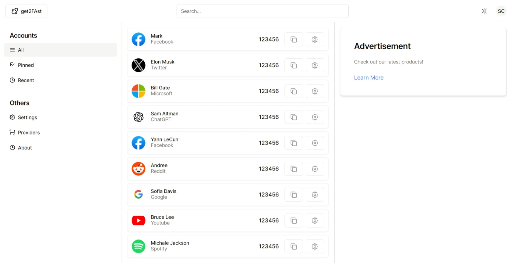
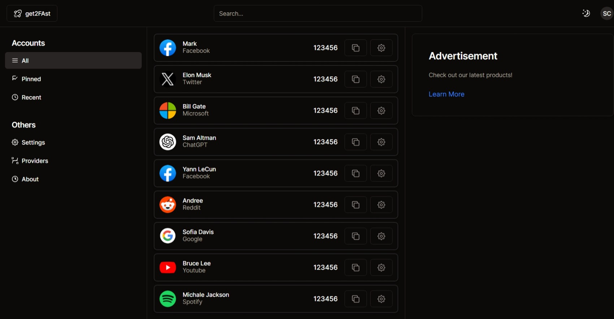

This is the old UI for fly2FAst, built with Next.js and Shadcn.
It's deprecated due to my limited knowledge of tailwind-css.
I'll make a better version later.




## Getting Started

To start the development server, run the following command:

```bash
npm run dev
# or
yarn dev
# or
pnpm dev
# or
bun dev
```

Open [http://localhost:3000](http://localhost:3000) in your browser to see the result.
You can begin editing the page by modifying `app/page.tsx`. The page will automatically update as you make changes.
This project utilizes [`next/font`](https://nextjs.org/docs/basic-features/font-optimization) to optimize and load Inter, a custom Google Font.

## Learn More

To learn more about Next.js, refer to the following resources:

- [Next.js Documentation](https://nextjs.org/docs) - learn about Next.js features and API.
- [Learn Next.js](https://nextjs.org/learn) - an interactive Next.js tutorial.
  Feel free to explore [the Next.js GitHub repository](https://github.com/vercel/next.js/) and contribute your feedback!

## Deploy on Vercel

The easiest way to deploy your Next.js app is by using the [Vercel Platform](https://vercel.com/new?utm_medium=default-template&filter=next.js&utm_source=create-next-app&utm_campaign=create-next-app-readme) created by the Next.js team.
For more details, check out our [Next.js deployment documentation](https://nextjs.org/docs/deployment).

## Tasks

- [x] Basic UI
- [ ] User authentication and authorization
- [ ] Database integration
- [ ] API endpoints for data retrieval and manipulation
- [ ] Responsive design for mobile devices
- [ ] Search functionality
- [ ] User profile page
- [ ] Documentation and code comments

## Getting Started

To start the development server, run the following command:

```bash
npm run dev
# or
yarn dev
# or
pnpm dev
# or
bun dev
```

Open [http://localhost:3000](http://localhost:3000) in your browser to see the result.

You can begin editing the page by modifying `app/page.tsx`. The page will automatically update as you make changes.

This project utilizes [`next/font`](https://nextjs.org/docs/basic-features/font-optimization) to optimize and load Inter, a custom Google Font.

## Learn More

To learn more about Next.js, refer to the following resources:

- [Next.js Documentation](https://nextjs.org/docs) - learn about Next.js features and API.
- [Learn Next.js](https://nextjs.org/learn) - an interactive Next.js tutorial.

Feel free to explore [the Next.js GitHub repository](https://github.com/vercel/next.js/) and contribute your feedback!

## Deploy on Vercel

The easiest way to deploy your Next.js app is by using the [Vercel Platform](https://vercel.com/new?utm_medium=default-template&filter=next.js&utm_source=create-next-app&utm_campaign=create-next-app-readme) created by the Next.js team.

For more details, check out our [Next.js deployment documentation](https://nextjs.org/docs/deployment).

## Tasks

- [x] Basic UI
- [ ] User authentication and authorization
- [ ] Database integration
- [ ] API endpoints for data retrieval and manipulation
- [ ] Responsive design for mobile devices
- [ ] Search functionality
- [ ] User profile page
- [ ] Documentation and code comments
